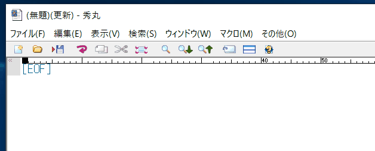
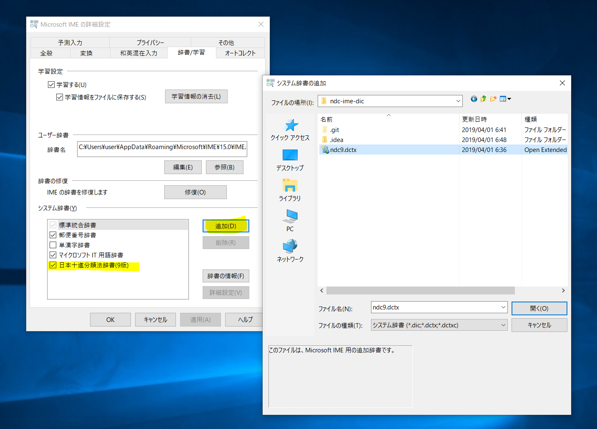
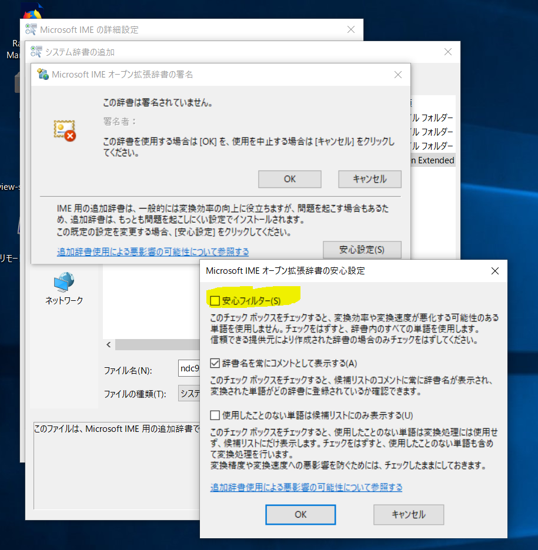

# ndc-ime-dic
日本十進分類法のIME辞書

漢字変換時にNDCのラベルを簡単に展開できます。現在のところ、MS-IMEのオープン拡張辞書形式に対応しています。

## 動作画面

 
  
## インストール方法

- [辞書ファイル v1.0](https://github.com/ndc-dev/ndc-ime-dic/releases/download/v1.0/ndc9.dctx)をダウンロードしてください。
- 「Microsoft IME」の設定画面から次のように辞書ファイルを追加してください。
    
   
- セキュリティに関する警告画面が表示されます

- 安心フィルターの設定を外すと「0」のような文字数の少ないNDCでも検索結果が表示されるようになります。
   